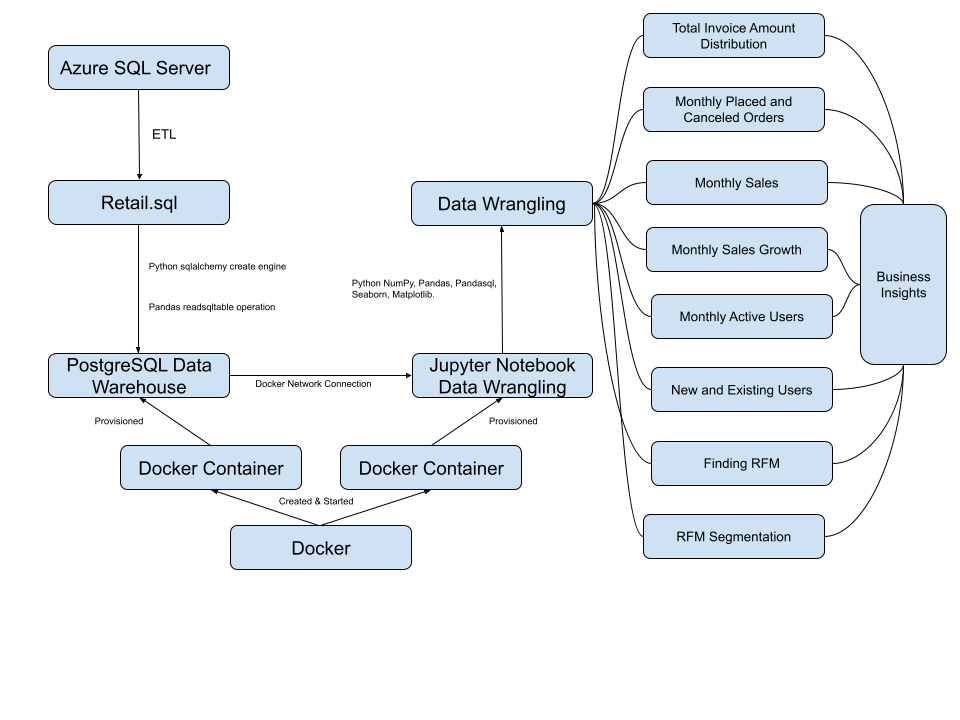

# Introduction
The London Gift Shop(LGS) marketing team is seeking consulting service from the Jarvis Data Analytics team. Essentially the Jarvis Data Analytics Team is to utilize the latest data technologies to understand customer behaviours, develop sales, and expand market share.

The Jarvis Data Team implemented preliminary data analysis in the PostgreSQL instance with SQL. The Jarvis Data Team implemented further data wrangling analytics in Jupyter Notebook with the following business questions answered:

- Total Invoice Amount Distribution
- Monthly Placed and Canceled Orders
- Monthly Sales
- Monthly Sales Growth
- Monthly Active Users
- New and Existing Users
- Finding RFM
- RFM Segmentation

The LGS is to utilize the questions reports and insights for further inventory/warehouse management, shifts/personnel resource management, experimental measures to boost sales when it presides low in the valley, and so forth.

The Jarvis Data Team used Docker, PostgreSQL, Jupyter Notebook, Python Sqlalchemy, Numpy, Pandas, Seaborn, matplotlib, pandasql in this project.

- Describe the business context of this project (please do not copy-paste text from the project kick-off ticket)
- Also, describe how LGS would use your analytic result (hint: see kick-off ticket)
- Describe your work and technologies used (e.g. Jupyter Notebook, Python libraries, data analytics, data warehouse, etc.)

# Implementaion
## Project Architecture
The LGS Web APP uses Azure services in backend API management, frontend, and database servers. Since it's a PoC project, the Jarvis team does not have access to work in the LGS Azure Environment.
The LGS ETLed the data between december 2009 to december 2011 into a sql file and shared this sql file with the Jarvis Data Team. 
The Jarvis team stored the data in a PostgreSQL instance provisioned by docker. The Jarvis Team performed data exploration with data_explore.sql, gaining preliminary apprehension to the dataset.
Also, this PostgreSQL instance serves as the data warehouse, the foundation for the next step: data wrangling. 
The Jarvis Data Team constructed a Jupyter Notebook instance through docker, connected the Jupyter instance with the PostgreSQL instance through a docker network.
This essentially helps the data team to import data from the PostgreSQL instance into Jupyter Notebook as a data frame for further analysis purposes. The Jarvis team led comprehensive data analysis towards the imported data and generated business insights based on the analysis results.

- An Architecture Diagram:

## Data Analytics and Wrangling
See the following link:
https://github.com/jarviscanada/jarvis_data_eng_OwenLiu/blob/feature/Jupyter/python_data_analytics/psql/retail_data_analytics_wrangling.ipynb

**Data Description**
The dataset mainly contains the sales information of each order through a certain time span. It contains 8 attributes and over 1 million tuples. 8 attributes includes invoice, stockcode, description, quantity, invoicedate, price, customerID, and Country.

**Elementary Data Analysis(EDA)**
The analytics team have implemented data cleaning in dropping around 200k rows lacking significant information relevant to data analytics. The analytics team have applied rule of universality of CamelCase column name naming when changing column names. And the analytics team have assigned accurate data types to different attributes based on the data stored in.

**Business Descriptive Analysis**
- Total Invoice Amount Distribution

   This question finds the total invoice sales amount aggregated by each invoice number. From the first distribution histogram, we can see most of the sales amounted around negative 594 dollars to positive 594 dollars with scattered outliers. Then we drew another diagram with 85% quantile specified. This diagram with 85% quantile shows a clearer image that the mean, medium, and mode values are all situated between 0 to 597. This explains that a considerable number of invoices hold a positive value ranged from 0 to 597, few number of invoices hold a negative value from -597 to 0, and some invoices are scarcely located outside of the 85% quantile.

- Monthly Placed and Canceled Orders

   This question finds the montly placed and canceled orders aggregated by month. Inspired by the canceled and placed order comparison bar chart, the analytics team drew a cancellation rate chart. The average cancellation rate is 2.4%. The cancellation rates across two years fluctuates around the average line with no observable pattern. We can safely conclude that the LRA has a low cancellation rate and products have been well accepted and profitable.

- Monthly Sales, Monthly Sales Growth
   
    These two question finds the monthly sales from 2009 to 2011 and its growth trend as time elapses. The average sales per month is around 680K Dollars. The monthly sales fluctuate around the avg line with no observerable pattern. Each year the sales starts to climb up around June and peaks in November, indicating the public shopping surge in summer till the beginning of holidays. From December to May, the sales downfall below the avg line, indicating diminishment of shopping activities in winter.

- Monthly Active Users
   
    This question finds the monthly active users from 2009 to 2011. As the bar plots indicate, the active users peak around November each year. The average of monthly active users is around 1080.

- New and Existing Users
   
    This question finds the monthly new and existing users from 2009 to 2011. As the comparative bar plots indicate, existing users peak around November of each year. New users take up a small share of the total users in general.

- Finding RFM, RFM Model

  This question finds the RFM model for the dataset. RFM is a method usedRFM for analyzing customer value. It is commonly used in database marketing and direct marketing and has received particular attention in the retail and professional services industries. ([wikipedia](https://en.wikipedia.org/wiki/RFM_(market_research))) It stands for three dimensions:

    - Recency: How recently did the customer purchase?

    - Frequency: How often do they purchase?

    - Monetary Value: How much do they spend?

- RFM Segmentation and Plot.
  
  The RFM segmentation allocates the attributes: regency, frequency, and monetary value into categorical score values. Each attribute has 5 possible categorical values, 1,2,3,4,5. Using the panda qcut function, we derive the values for each tuple based on its location of the value spectrum spanning the whole column. Concatenating three scores renders the final RFM Score ranging from 111 to 555. We then use predefined regex and replace regency score + frequency score with segmentation comments. Eventually, we have come to a RFM Segmentation Plot in which it shows the predominant types of customers.
  Dominancy High-to-low ranked: Champions, Hibernating, at risk, potential loyalists, loyal customers, about to sllep, new customers, need attention, can't lose, promising.

**Recommendation**

From the business descriptive analysis, we have concluded that there exists a surge in terms of active users and sales from summer to holiday season. Further descriptive analysis can be conducted towards types of merchandises that experience sales surge.Also, diagnostic analysis can be conducted towards the downfall happening between December and April, seeking to tackle and neutralize the downfall.

Primary predictive analysis can be conducted towards sales/active users increment for the years to come based on the data of previous years. Furhter predictive analysis can be conducted towards merchandise description NLP in analyzing what merchandises may attract more sales.

Inspired by predictive analysis reports, prescriptive analysis can be implemented towards inventory/warehouse management, shifts/personnel allocation to time slots, experimental measures to boost sales when it presides low in the valley, and so forth.

# Improvements
- The Jarvis team could provide a predictive analysis model based on the historical data. Essentially, the Jarvis team can
conduct further prediction of sales for the years to come with machine learning algorithms. But, this approach may need more data to predict target variables aggregated by months. 
- In several business questions, intermediate Data Frames were used for the limit of pandasql. This enlarged the memory space and burden. The business question can be analyzed through stand-alone Pandas aggregate and join operations without the use of pandasql.
- In graph drawing, the Jarvis team can add elements to the graph looking for more insightful indications such as error bars, trend line, etc.
